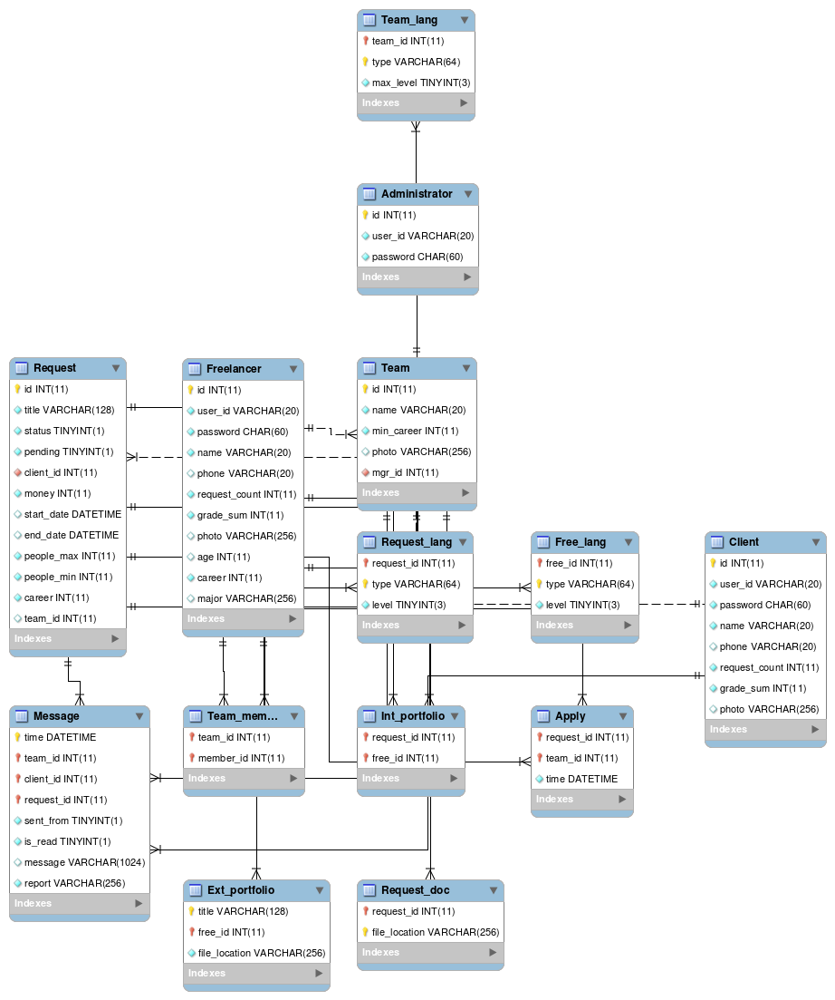

### Freelancer - Client Web Matching Service

Using nodejs (backend) + reactjs (frontend)

Full responsive application


### Demo

https://github.com/jgtonys/freelancer-web-matching.git

[](https://youtu.be/lg0wD5D7Ucg)


### How to run

- git clone
- root directory - `npm install`
- client directory - `npm install`
- root directory - `npm start`

> To build client files `npm run build`


### Functions

Token authentication (JWT) + Session-Storage

File upload with Multer

Encryption with Bcrypt


### Development Environment

es6(babel), axios, node-sass, SPA, webpack

**Backend**

```json
"dependencies": {
    "async": "^2.6.0",
    "bcrypt": "^3.0.2",
    "body-parser": "^1.18.2",
    "express": "^4.16.3",
    "jsonwebtoken": "^8.2.0",
    "lodash": "^4.17.5",
    "multer": "^1.4.1",
    "mysql2": "^1.6.1"
}
```

**Frontend**

```json
"dependencies": {
    "@babel/plugin-proposal-class-properties": "^7.1.0",
    "@babel/polyfill": "^7.0.0",
    "@material-ui/core": "^3.4.0",
    "@material-ui/icons": "^3.0.1",
    "axios": "^0.18.0",
    "babel-runtime": "^6.26.0",
    "bootstrap": "^4.1.3",
    "cross-env": "^5.2.0",
    "css-loader": "^1.0.1",
    "node-sass": "^4.9.4",
    "react": "^16.6.0",
    "react-dom": "^16.6.0",
    "react-pdf": "^4.0.0",
    "react-redux": "^5.1.0",
    "react-router": "^4.3.1",
    "react-router-dom": "^4.3.1",
    "react-swipeable-views": "^0.13.0",
    "react-text-mask": "^5.4.3",
    "reactstrap": "^6.5.0",
    "redux": "^4.0.1",
    "sass-loader": "^7.1.0",
    "style-loader": "^0.23.1",
    "webpack": "^4.23.1",
    "webpack-cli": "^3.1.2",
    "webpack-dev-server": "^3.1.10"
},
"devDependencies": {
    "@babel/core": "^7.1.2",
    "@babel/preset-env": "^7.1.0",
    "@babel/preset-react": "^7.0.0",
    "babel-loader": "^8.0.4",
    "html-webpack-plugin": "^3.2.0"
}
```


**Structure**

- app (backend)
  - controller (server app controller)
  - models (database models)
  - routes (routing)
- client (frontend)
- config
  - config.js (port, session setting)
  - db.js (database setting)
  - express.js 
  - jwt.js (optional, token authentication)
- server.js
- package.json (npm install modules, description)


### Database Model




